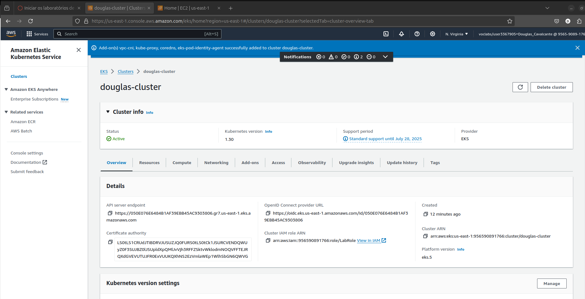
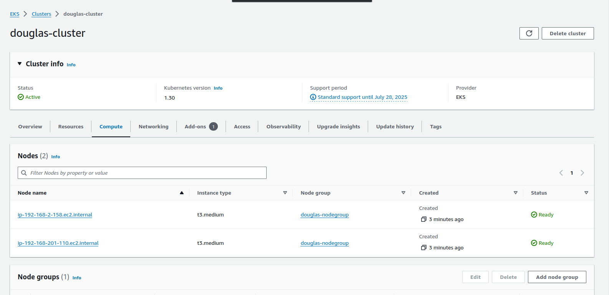
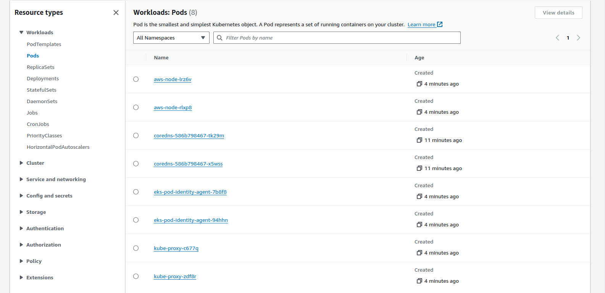
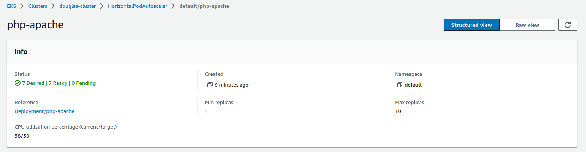
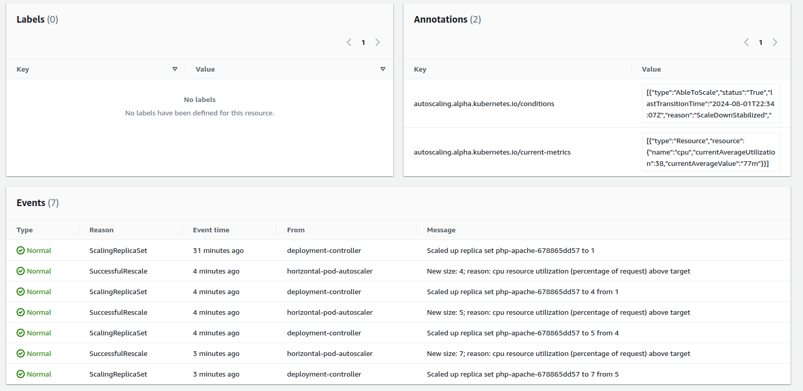
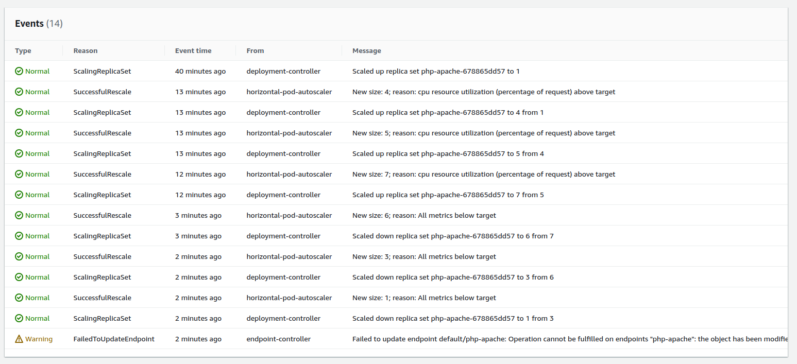

PSI5120 – Tópicos em Computação em Nuvem (2024)

Aluno: Douglas Bellomo Cavalcante

Nº USP: 13079274

01 de agosto de 2024

Avaliação Intermediária

# 1) Escalamento Horizontal de PODs

## 1.1) Informações da máquina (obtidas com o Neofetch)

Host

> douglas@douglas-ipt

> -------------------

> OS: Ubuntu 24.04 LTS x86_64

> Host: 20TB000TBO ThinkPad E14 Gen 2

> Kernel: 6.8.0-39-generic

> Uptime: 1 hour, 18 mins

> Packages: 2842 (dpkg), 18 (snap)

> Shell: bash 5.2.21

> Resolution: 1920x1080

> DE: GNOME 46.0

> WM: Mutter

> WM Theme: Adwaita

> Theme: Yaru-purple-dark \[GTK2/3\]

> Icons: Yaru-purple \[GTK2/3\]

> Terminal: tilix

> CPU: 11th Gen Intel i7-1165G7 (8) @

> GPU: NVIDIA GeForce MX450

> GPU: Intel TigerLake-LP GT2 \[Iris Xe

> Memory: 9772MiB / 15691MiB

Guest (ambiente QEMU/KVM)

> douglas@minikube-lubuntu

> ------------------------

> OS: Lubuntu 24.04 LTS x86_64

> Host: KVM/QEMU (Standard PC (Q35 + ICH9, 2009) pc-q35-8.2)

> Kernel: 6.8.0-38-generic

> Uptime: 1 hour, 1 min

> Packages: 1864 (dpkg), 7 (snap)

> Shell: bash 5.2.21

> Resolution: 1024x768

> DE: LXQt 1.4.0

> WM: Openbox

> Theme: Breeze \[GTK3\]

> Icons: ePapirus \[GTK3\]

> Terminal: tilix

> CPU: 11th Gen Intel i7-1165G7 (2) @ 2.803GHz

> GPU: 00:01.0 Red Hat, Inc. QXL paravirtual graphic card

> Memory: 1316MiB / 3916MiB

## 1.2) Walktrough do Horizontal Pod Scaling

### 1.2.1) Verificando a instalação do kubectl e habilitando o metrics-server no minikube
```
douglas@minikube-lubuntu:~$ kubectl version

Client Version: v1.30.3

Kustomize Version: v5.0.4-0.20230601165947-6ce0bf390ce3

Unable to connect to the server: dial tcp 192.168.49.2:8443: connect: no
route to host

douglas@minikube-lubuntu:~$ minikube addons enable metrics-server

💡 metrics-server is an addon maintained by Kubernetes. For any concerns
contact minikube on GitHub.

You can view the list of minikube maintainers at:
https://github.com/kubernetes/minikube/blob/master/OWNERS

🌟 The 'metrics-server' addon is enabled
```

### 1.2.2) Criando o .yaml da aplicação
```
douglas@minikube-lubuntu:~$ mkdir intermediate_test

douglas@minikube-lubuntu:~$ cd intermediate_test/

douglas@minikube-lubuntu:~/intermediate_test$ nano php-apache.yaml

douglas@minikube-lubuntu:~/intermediate_test$ cat php-apache.yaml

apiVersion: apps/v1
kind: Deployment
metadata:
  name: php-apache
spec:
  selector:
    matchLabels:
      run: php-apache
  template:
    metadata:
      labels:
        run: php-apache
    spec:
      containers:
      - name: php-apache
        image: registry.k8s.io/hpa-example
        ports:
        - containerPort: 80
        resources:
          limits:
            cpu: 500m
          requests:
            cpu: 200m
---
apiVersion: v1
kind: Service
metadata:
  name: php-apache
  labels:
    run: php-apache
spec:
  ports:
  - port: 80
  selector:
    run: php-apache
```

### 1.2.3) Iniciando o minikube e efetuando o deploy da aplicação php-apache
```
douglas@minikube-lubuntu:~/intermediate_test$ minikube start
--driver=docker

😄 minikube v1.33.1 on Ubuntu 24.04 (kvm/amd64)

✨ Using the docker driver based on existing profile

👍 Starting "minikube" primary control-plane node in "minikube" cluster

🚜 Pulling base image v0.0.44 ...

🔄 Restarting existing docker container for "minikube" ...

🐳 Preparing Kubernetes v1.30.0 on Docker 26.1.1 ...

🔎 Verifying Kubernetes components...

▪ Using image registry.k8s.io/metrics-server/metrics-server:v0.7.1

▪ Using image docker.io/kubernetesui/dashboard:v2.7.0

▪ Using image gcr.io/k8s-minikube/storage-provisioner:v5

▪ Using image docker.io/kubernetesui/metrics-scraper:v1.0.8

💡 Some dashboard features require the metrics-server addon. To enable
all features please run:

minikube addons enable metrics-server

🌟 Enabled addons: storage-provisioner, metrics-server, dashboard,
default-storageclass

🏄 Done! kubectl is now configured to use "minikube" cluster and
"default" namespace by default

douglas@minikube-lubuntu:~/intermediate_test$ minikube addons enable
metrics-server

💡 metrics-server is an addon maintained by Kubernetes. For any concerns
contact minikube on GitHub.

You can view the list of minikube maintainers at:
https://github.com/kubernetes/minikube/blob/master/OWNERS

▪ Using image registry.k8s.io/metrics-server/metrics-server:v0.7.1

🌟 The 'metrics-server' addon is enabled
```

```
douglas@minikube-lubuntu:~/intermediate_test$ kubectl apply -f
php-apache.yaml

deployment.apps/php-apache created

service/php-apache created
```
### 1.2.4) Habilitando o HPA
```
douglas@minikube-lubuntu:~/intermediate_test$ kubectl autoscale
deployment php-apache --cpu-percent=50 --min=1 --max=10

horizontalpodautoscaler.autoscaling/php-apache autoscaled

douglas@minikube-lubuntu:~/intermediate_test$ kubectl get hpa

NAME REFERENCE TARGETS MINPODS MAXPODS REPLICAS AGE

php-apache Deployment/php-apache cpu: \<unknown\>/50% 1 10 0 13s

douglas@minikube-lubuntu:~/intermediate_test$ kubectl get hpa

NAME REFERENCE TARGETS MINPODS MAXPODS REPLICAS AGE

php-apache Deployment/php-apache cpu: 0%/50% 1 10 1 45s

douglas@minikube-lubuntu:~/intermediate_test$ kubectl get hpa php-apache
--watch

NAME REFERENCE TARGETS MINPODS MAXPODS REPLICAS AGE

php-apache Deployment/php-apache cpu: 19%/50% 1 10 1 105s
```

### 1.2.5) Testando o HPA
```
douglas@minikube-lubuntu:~/intermediate_test$ kubectl get hpa php-apache
--watch

NAME REFERENCE TARGETS MINPODS MAXPODS REPLICAS AGE

php-apache Deployment/php-apache cpu: 19%/50% 1 10 1 2m32s

php-apache Deployment/php-apache cpu: 250%/50% 1 10 1 2m45s

php-apache Deployment/php-apache cpu: 250%/50% 1 10 4 3m

php-apache Deployment/php-apache cpu: 250%/50% 1 10 5 3m15s

php-apache Deployment/php-apache cpu: 124%/50% 1 10 5 3m45s

php-apache Deployment/php-apache cpu: 69%/50% 1 10 5 4m45s

php-apache Deployment/php-apache cpu: 69%/50% 1 10 7 5m

php-apache Deployment/php-apache cpu: 67%/50% 1 10 7 5m45s

php-apache Deployment/php-apache cpu: 67%/50% 1 10 7 6m45s

php-apache Deployment/php-apache cpu: 69%/50% 1 10 7 7m45s

php-apache Deployment/php-apache cpu: 67%/50% 1 10 7 8m45s

php-apache Deployment/php-apache cpu: 65%/50% 1 10 7 9m45s

php-apache Deployment/php-apache cpu: 68%/50% 1 10 7 10m

php-apache Deployment/php-apache cpu: 67%/50% 1 10 7 11m

php-apache Deployment/php-apache cpu: 68%/50% 1 10 7 12m

php-apache Deployment/php-apache cpu: 5%/50% 1 10 7 13m

php-apache Deployment/php-apache cpu: 0%/50% 1 10 7 14m

php-apache Deployment/php-apache cpu: 0%/50% 1 10 7 18m

php-apache Deployment/php-apache cpu: 0%/50% 1 10 1 18m

php-apache Deployment/php-apache cpu: 0%/50% 1 10 1 19m
```

### 1.2.6) Gerador de carga (terminal paralelo)
```

douglas@minikube-lubuntu:~$ kubectl run -i --tty load-generator --rm
--image=busybox:1.28 --restart=Never -- /bin/sh -c "while sleep 0.01; do
wget -q -O- http://php-apache; done"

If you don't see a command prompt, try pressing enter.

OK!OK!OK!OK!OK!OK!OK!OK!OK!OK!OK!OK!OK!OK!OK!OK!OK!OK!OK!OK!OK!OK!OK!OK!OK!OK!OK!OK!OK!OK!OK!OK!OK!OK!OK!OK!OK!OK!OK!OK!OK!OK!OK!OK!OK!OK!OK!OK!OK!OK!OK!OK!OK!OK!OK!OK!OK!OK!OK!OK!OK!OK!OK!OK!OK!OK!OK!OK!OK!OK!OK!OK!OK!OK!OK!OK!OK!OK!OK!OK!OK!OK!OK!OK!OK!OK!OK!OK!OK!OK!OK!OK!OK!OK!OK!OK!OK!OK!OK!OK!OK!OK!OK!OK!OK!OK!OK!OK!OK!OK!OK!OK!OK!OK!OK!OK!OK!OK!OK!OK!OK!OK!OK!OK!OK!OK!OK!OK!OK!OK!OK!OK!OK!OK!OK!OK!OK!OK!OK!OK!OK!OK!OK!OK!OK!OK!OK!OK!OK!OK!OK!OK!OK!OK!OK!OK!OK!OK!OK!OK!OK!OK!OK!OK!OK!OK!OK!OK!OK!OK!OK!OK!OK!OK!OK!OK!OK!OK!OK!OK!OK!OK!OK!OK!OK!OK!OK!OK!OK!OK!OK!OK!OK!OK!OK!OK!OK!OK!OK!OK!OK!OK!OK!OK!OK!OK!OK!OK!OK!OK!OK!OK!OK!OK!OK!OK!OK!OK!OK!OK!OK!OK!OK!OK!OK!OK!OK!OK!OK!OK!OK!OK!OK!OK!OK!OK!OK!OK!OK!OK!OK!OK!OK!OK!OK!OK!OK!OK!OK!OK!OK!OK!OK!OK!OK!OK!OK!OK!OK!OK!OK!OK!OK!OK!OK!OK!OK!OK!OK!OK!OK!OK!OK!OK!OK!OK!OK!OK!OK!OK!OK!OK!OK!OK!OK
```

# 2) Walktrough do Horizontal Pod Scaling

## 2.1) Restrições da conta Academy:

##### <span id="anchor"></span>Amazon Elastic Kubernetes Service (EKS)

- This service can assume the LabRole IAM role.
- Supported Instance types: nano, micro, small, medium, and large.

## 2.2) Criando o cluster

### 2.2.1) Criando a VPC
```
douglas@douglas-ipt:~$ aws cloudformation create-stack --region
us-east-1 --stack-name douglas-eks-vpc-stack --template-url
https://s3.us-west-2.amazonaws.com/amazon-eks/cloudformation/2020-10-29/amazon-eks-vpc-private-subnets.yaml

{

"StackId":
"arn:aws:cloudformation:us-east-1:956590891766:stack/douglas-eks-vpc-stack/91d92b40-504c-11ef-b716-12a6a9bda809"

}
```
### 2.2.2) Criando o cluster usando o Role LabRole



### 2.2.3) Atualizando o kubeconfig local
```
douglas@douglas-ipt:~$ aws eks update-kubeconfig --region us-east-1
--name douglas-cluster

Added new context
arn:aws:eks:us-east-1:956590891766:cluster/douglas-cluster to
/home/douglas/.kube/config
```

```
douglas@douglas-ipt:~$ kubectl get svc

NAME TYPE CLUSTER-IP EXTERNAL-IP PORT(S) AGE

kubernetes ClusterIP 10.100.0.1 \<none\> 443/TCP 8m11s
```

### 2.2.4) Criando os nós via instâncias EC2 – Role LabRole

Nós adicionados via interface web do AWS EKS.





## 2.3) Fazendo o deploy da aplicação php-apache

Foi escolhida a aplicaçao PHP-Apache para efetuar comparações com o item
1

### 2.3.1) Criando um namespace do Kubernetes
```
douglas@douglas-ipt:~$ kubectl create namespace php-apache-douglas

namespace/php-apache-douglas created
```

### 2.3.2) Criando o yaml de deploy do php-apache
```

douglas@douglas-ipt:~$ cat php-apache.yaml

apiVersion: apps/v1

kind: Deployment

metadata:

name: php-apache

spec:

selector:

matchLabels:

run: php-apache

template:

metadata:

labels:

run: php-apache

spec:

containers:

 - name: php-apache

image: registry.k8s.io/hpa-example

ports:

 - containerPort: 80

resources:

limits:

cpu: 500m

requests:

cpu: 200m

---

apiVersion: v1

kind: Service

metadata:

name: php-apache

labels:

run: php-apache

spec:

ports:

 - port: 80

selector:

run: php-apache
```

### 2.3.3) Fazendo o deploy
```

douglas@douglas-ipt:~$ kubectl apply -f php-apache.yaml

deployment.apps/php-apache created

service/php-apache created
```

### 2.3.4) Criando e aplicando o serviço
```

douglas@douglas-ipt:~$ cat php-apache-service.yaml

apiVersion: v1

kind: Service

metadata:

name: php-apache-service

namespace: php-apache-douglas

labels:

app: php-apache

spec:

selector:

app: php-apache

ports:

 - protocol: TCP

port: 80

targetPort: 80
```

```

douglas@douglas-ipt:~$ kubectl apply -f php-apache-service.yaml

service/php-apache-service created
```

### 2.3.5) Verificando os recursos, serviços e pods

```
douglas@douglas-ipt:~$ kubectl get all

NAME READY STATUS RESTARTS AGE

pod/php-apache-678865dd57-qmf6w 1/1 Running 0 15m

NAME TYPE CLUSTER-IP EXTERNAL-IP PORT(S) AGE

service/kubernetes ClusterIP 10.100.0.1 \<none\> 443/TCP 43m

service/php-apache ClusterIP 10.100.170.44 \<none\> 80/TCP 15m

NAME READY UP-TO-DATE AVAILABLE AGE

deployment.apps/php-apache 1/1 1 1 15m

NAME DESIRED CURRENT READY AGE

replicaset.apps/php-apache-678865dd57 1 1 1 15m
```

```
douglas@douglas-ipt:~$ kubectl -n php-apache-douglas describe service
php-apache-service

Name: php-apache-service

Namespace: php-apache-douglas

Labels: app=php-apache

Annotations: \<none\>

Selector: app=php-apache

Type: ClusterIP

IP Family Policy: SingleStack

IP Families: IPv4

IP: 10.100.176.14

IPs: 10.100.176.14

Port: \<unset\> 80/TCP

TargetPort: 80/TCP

Endpoints: \<none\>

Session Affinity: None

Events: \<none\>
```

## 2.4) Habilitando o KubernetesMetrics Server

### 2.4.1) Efeutando o deploy
```
douglas@douglas-ipt:~$ kubectl apply -f
https://github.com/kubernetes-sigs/metrics-server/releases/latest/download/components.yaml

serviceaccount/metrics-server created

clusterrole.rbac.authorization.k8s.io/system:aggregated-metrics-reader
created

clusterrole.rbac.authorization.k8s.io/system:metrics-server created

rolebinding.rbac.authorization.k8s.io/metrics-server-auth-reader created

clusterrolebinding.rbac.authorization.k8s.io/metrics-server:system:auth-delegator
created

clusterrolebinding.rbac.authorization.k8s.io/system:metrics-server
created

service/metrics-server created

deployment.apps/metrics-server created

apiservice.apiregistration.k8s.io/v1beta1.metrics.k8s.io created
```

### 2.4.2) Verificando o deploy
```
douglas@douglas-ipt:~$ kubectl get deployment metrics-server -n
kube-system

NAME READY UP-TO-DATE AVAILABLE AGE

metrics-server 0/1 1 0 28s

douglas@douglas-ipt:~$ kubectl get deployment metrics-server -n
kube-system

NAME READY UP-TO-DATE AVAILABLE AGE

metrics-server 1/1 1 1 55s
```
### 2.4.3) Testando o metrics
```
douglas@douglas-ipt:~$ kubectl top nodes

NAME CPU(cores) CPU% MEMORY(bytes) MEMORY%

ip-192-168-2-158.ec2.internal 37m 1% 549Mi 16%

ip-192-168-201-110.ec2.internal 27m 1% 473Mi 14%
```
## 2.5) Habilitando o HPA

### 2.5.1) Criando o HPA
```
douglas@douglas-ipt:~$ kubectl autoscale deployment php-apache
--cpu-percent=50 --min=1 --max=10

horizontalpodautoscaler.autoscaling/php-apache autoscaled
```
### 2.5.2) Verificando o HPA
```
douglas@douglas-ipt:~$ kubectl get hpa

NAME REFERENCE TARGETS MINPODS MAXPODS REPLICAS AGE

php-apache Deployment/php-apache cpu: 0%/50% 1 10 1 31s
```
## 2.6) Observando o trabalho do HPA na AWS EKS

### 2.6.1) Criando o serviço de carga
```
douglas@douglas-ipt:~$ kubectl run -i \\

--tty load-generator \\

--rm --image=busybox \\

--restart=Never \\

-- /bin/sh -c "while sleep 0.01; do wget -q -O- http://php-apache; done"

If you don't see a command prompt, try pressing enter.

OK!OK!OK!OK!OK!OK!OK!OK!OK!OK!OK!OK!OK!OK!OK!OK!OK!OK!OK!OK!OK!OK!OK!OK!OK!OK!OK!OK!OK!OK!OK!OK!OK!OK!OK!OK!OK!OK!OK!OK!OK!OK!OK!OK!OK!OK!OK!OK!OK!OK!OK!OK!OK!OK!OK!OK!OK!OK!OK!OK!OK!OK!OK!OK!OK!OK!OK!OK!OK!OK!OK!OK!OK!OK!OK!OK!OK!OK!OK!OK!OK!OK!OK!OK!OK!OK!OK!OK!OK!OK!OK!OK!OK!OK!OK!OK!OK!OK!OK!OK!OK!OK!OK!OK!OK!OK!OK!OK!OK!OK!OK!OK!OK!OK!OK!OK!OK!OK!OK!OK!OK!OK!OK!OK!OK!OK!OK!OK!OK!OK!OK!OK!OK!OK!OK!OK!OK!OK!OK!OK!OK!OK!OK!OK!OK!OK!OK!OK!OK!OK!OK!OK!OK!OK!OK!OK!OK!OK!OK!OK!OK!OK!OK!OK!OK!OK!OK!OK!OK!OK!OK!OK!OK!OK!OK!OK!OK!OK!OK!OK!OK!OK!OK!OK!OK!OK!OK!OK!OK!OK!OK!OK!OK!OK!OK!OK!OK!OK!OK!OK!OK!OK!OK!OK!OK!OK!OK!OK!OK!OK!OK!OK!OK!OK!OK!OK!OK!OK!OK!OK!OK!OK
```
### 2.6.2) Observando os pods
```
douglas@douglas-ipt:~$ kubectl get hpa php-apache --watch

NAME REFERENCE TARGETS MINPODS MAXPODS REPLICAS AGE

php-apache Deployment/php-apache cpu: 0%/50% 1 10 1 4m52s

php-apache Deployment/php-apache cpu: 224%/50% 1 10 1 5m1s

php-apache Deployment/php-apache cpu: 248%/50% 1 10 4 5m16s

php-apache Deployment/php-apache cpu: 134%/50% 1 10 5 5m31s

php-apache Deployment/php-apache cpu: 60%/50% 1 10 5 5m46s

php-apache Deployment/php-apache cpu: 61%/50% 1 10 5 6m1s

php-apache Deployment/php-apache cpu: 52%/50% 1 10 7 6m16s

php-apache Deployment/php-apache cpu: 43%/50% 1 10 7 6m31s

php-apache Deployment/php-apache cpu: 39%/50% 1 10 7 6m46s

php-apache Deployment/php-apache cpu: 40%/50% 1 10 7 7m1s

php-apache Deployment/php-apache cpu: 43%/50% 1 10 7 7m16s

php-apache Deployment/php-apache cpu: 41%/50% 1 10 7 7m31s

php-apache Deployment/php-apache cpu: 40%/50% 1 10 7 7m46s

php-apache Deployment/php-apache cpu: 37%/50% 1 10 7 8m1s
```
### 2.6.3) Observando no AWS EKS





### 2.6.4) Retirando a carga

Conforme a nota abaixo, deve-se esperar 5 min para as réplicas
diminuírem

> Note

> The default timeframe for scaling back down is five minutes, so it
> will take some time before you see the replica count reach 1 again,
> even when the current CPU percentage is 0 percent. The timeframe is
> modifiable. For more information, see Horizontal Pod Autoscaler in the
> Kubernetes documentation.
```
php-apache Deployment/php-apache cpu: 38%/50% 1 10 7 9m1s

php-apache Deployment/php-apache cpu: 42%/50% 1 10 7 9m16s

php-apache Deployment/php-apache cpu: 39%/50% 1 10 7 9m31s

php-apache Deployment/php-apache cpu: 40%/50% 1 10 7 9m46s

php-apache Deployment/php-apache cpu: 41%/50% 1 10 7 10m

php-apache Deployment/php-apache cpu: 37%/50% 1 10 7 10m

php-apache Deployment/php-apache cpu: 45%/50% 1 10 7 10m

php-apache Deployment/php-apache cpu: 36%/50% 1 10 7 11m

php-apache Deployment/php-apache cpu: 39%/50% 1 10 7 11m

php-apache Deployment/php-apache cpu: 19%/50% 1 10 7 11m

php-apache Deployment/php-apache cpu: 0%/50% 1 10 7 11m

php-apache Deployment/php-apache cpu: 0%/50% 1 10 7 15m

php-apache Deployment/php-apache cpu: 0%/50% 1 10 6 16m

php-apache Deployment/php-apache cpu: 0%/50% 1 10 6 16m

php-apache Deployment/php-apache cpu: 0%/50% 1 10 3 16m

php-apache Deployment/php-apache cpu: 0%/50% 1 10 1 16m
```


[](https://docs.aws.amazon.com/eks/latest/userguide/getting-started-console.html)

Referências

<https://kubernetes.io/docs/tasks/run-application/horizontal-pod-autoscale-walkthrough/>

<https://docs.aws.amazon.com/eks/latest/userguide/getting-started-console.html>

<https://docs.aws.amazon.com/eks/latest/userguide/sample-deployment.html>

<https://docs.aws.amazon.com/eks/latest/userguide/metrics-server.html>

<https://docs.aws.amazon.com/eks/latest/userguide/horizontal-pod-autoscaler.html>
